# 🔍 AI Search Chat with PDF Citation Viewer

> A production-ready **Perplexity-style AI chat application** with real-time streaming responses, inline PDF citations, and a split-view PDF viewer.

**Author:** [PAMIDIROHIT](https://github.com/PAMIDIROHIT)

---

## 📑 Table of Contents

- [Overview](#-overview)
- [Features](#-features)
- [Architecture](#-architecture)
- [Sequence Diagrams](#-sequence-diagrams)
- [Class Diagrams (UML)](#-class-diagrams-uml)
- [Execution Flow](#-execution-flow)
- [Tech Stack](#-tech-stack)
- [Project Structure](#-project-structure)
- [Installation](#-installation)
- [API Documentation](#-api-documentation)
- [Design Decisions](#-design-decisions)
- [Screenshots](#-screenshots)
- [Docker Deployment](#-docker-deployment)
- [Libraries & Dependencies](#-libraries--dependencies)

---

## 🌟 Overview

This application demonstrates a modern AI-powered search interface inspired by [Perplexity AI](https://www.perplexity.ai/). It features:

- **Real-time streaming responses** using Server-Sent Events (SSE)
- **Inline clickable citations** that link to source PDFs
- **Smooth animated transitions** between chat and PDF viewer
- **Dark mode support** with theme persistence
- **Generative UI components** streamed alongside text responses

## ✨ Features

### Core Features

| Feature | Description |
|---------|-------------|
| 💬 **Chat Interface** | Clean, centered Perplexity-style design |
| 📡 **SSE Streaming** | Real-time character-by-character text streaming |
| 🔗 **Inline Citations** | Clickable `[1]`, `[2]`, `[3]` badges linked to PDFs |
| 📄 **PDF Viewer** | Split-view with zoom, navigation, and highlighting |
| 🛠️ **Tool Indicators** | Shows reasoning steps (Searching, Analyzing, etc.) |
| 🌙 **Dark Mode** | Toggle between light/dark themes |
| 📊 **Generative UI** | InfoCards, DataTables, StatCards streamed with responses |

### Technical Features

| Feature | Description |
|---------|-------------|
| 🔄 **State Management** | Zustand with persistence for theme |
| ⚡ **Animations** | Framer Motion for smooth transitions |
| 📱 **Responsive** | Mobile overlay / Desktop split-view |
| 🐳 **Docker Ready** | docker-compose for full stack deployment |
| 📝 **Type Safety** | Full TypeScript with strict mode |

---

## 🏗 Architecture

### High-Level Architecture

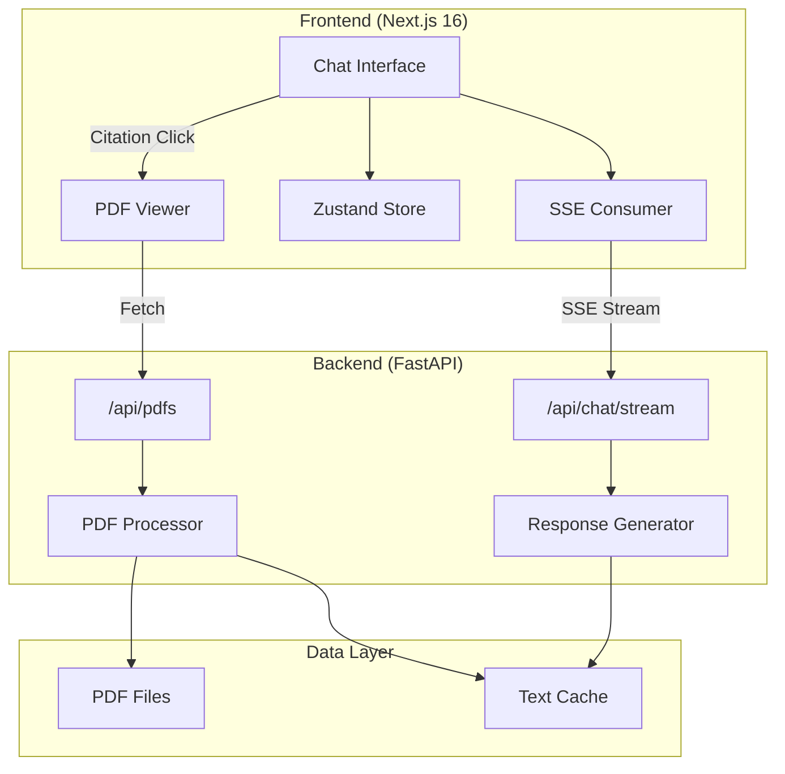

### Component Architecture

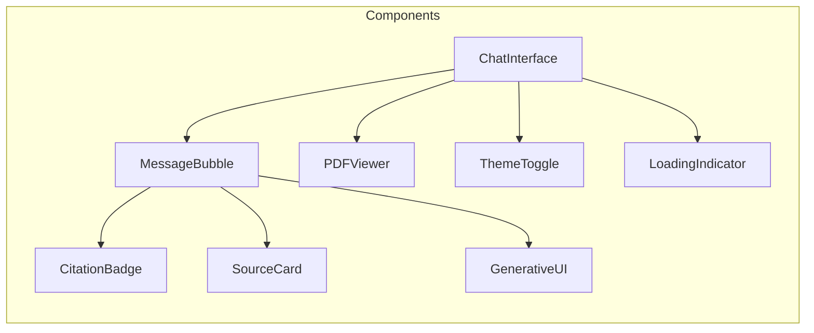

---

## 📊 Sequence Diagrams

### Chat Request Flow

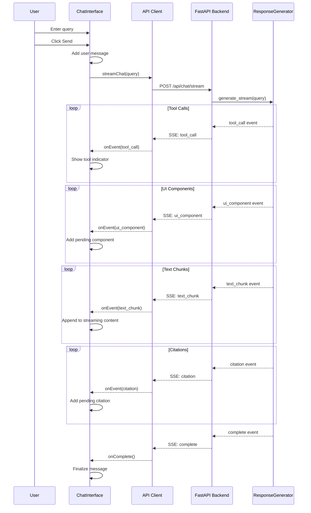

### PDF Citation Click Flow

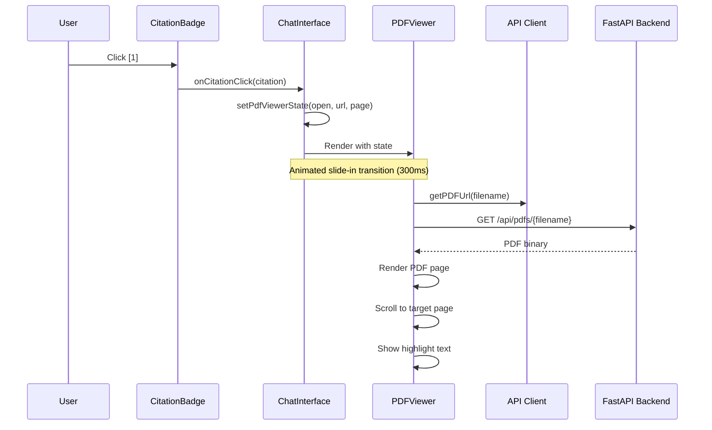

### Theme Toggle Flow

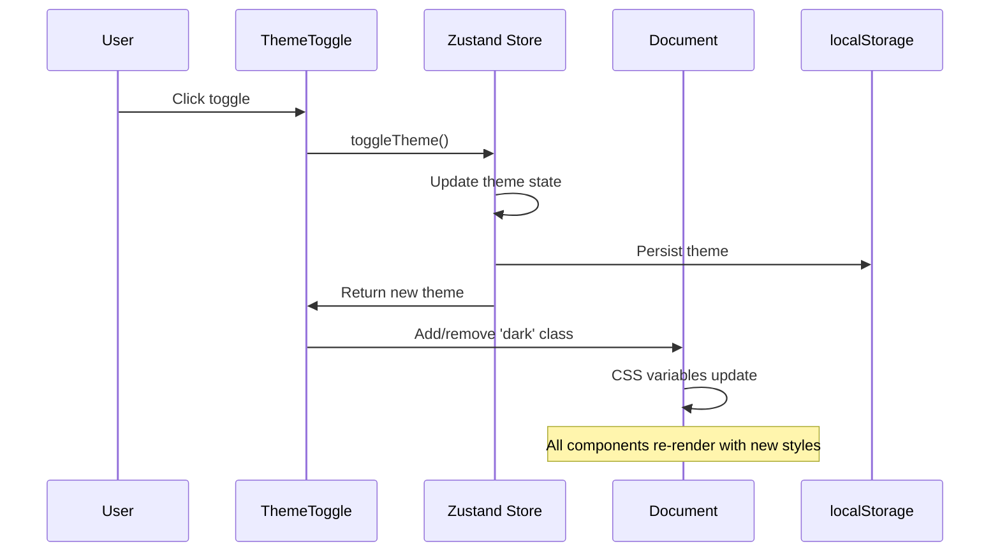

---

## 📐 Class Diagrams (UML)

### Frontend Type System

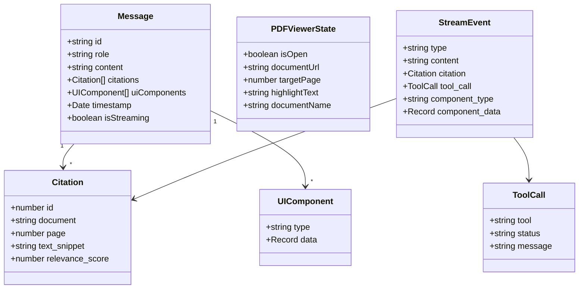

### Backend Schema Relationships

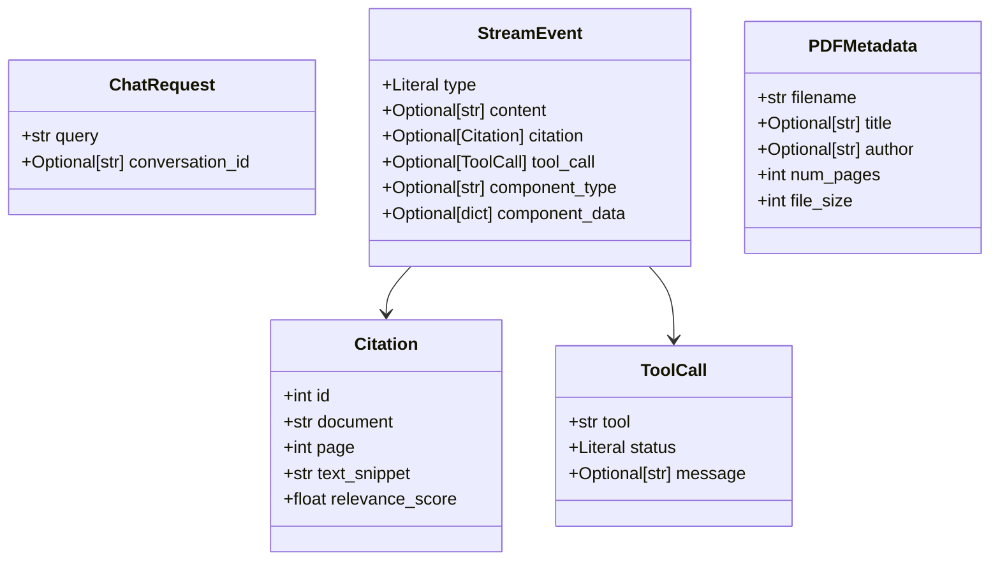

### Service Classes

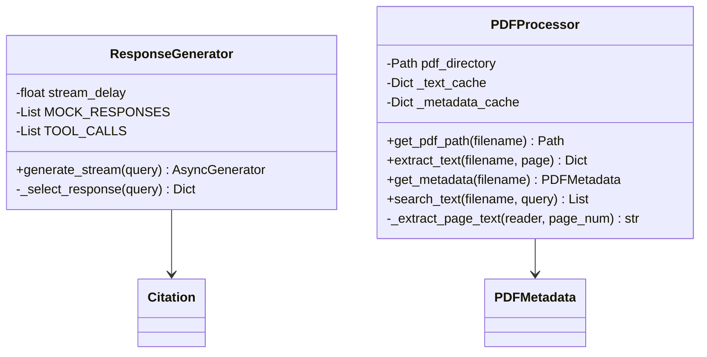

---

## 🔄 Execution Flow

### Application Startup

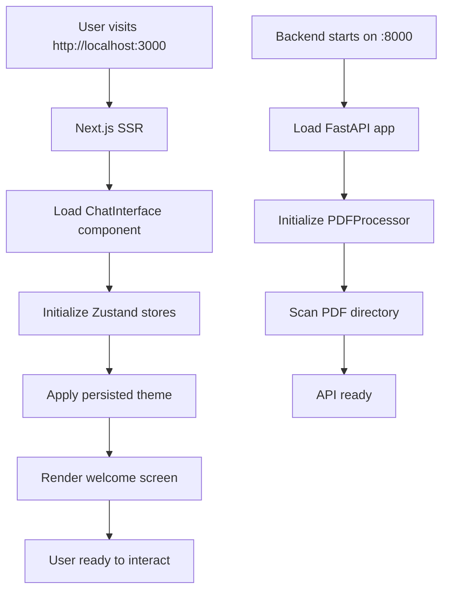

### Message Processing Pipeline

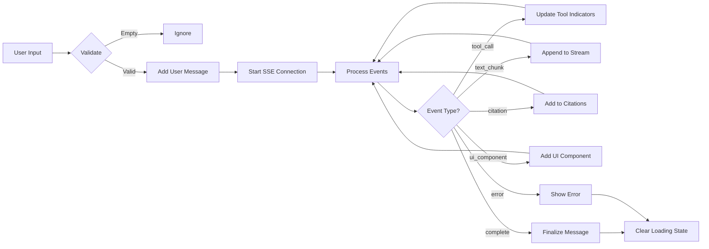

### PDF Viewer State Machine

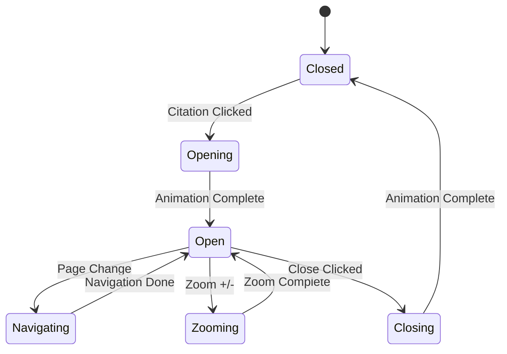

---

## 🛠 Tech Stack

### Frontend

| Technology | Version | Purpose |
|------------|---------|---------|
| Next.js | 16.1.1 | React framework with App Router |
| TypeScript | 5.x | Type safety |
| Tailwind CSS | 4.x | Styling with dark mode |
| Framer Motion | 12.x | Animations and transitions |
| react-pdf | 10.x | PDF rendering with PDF.js |
| Zustand | 5.x | State management with persistence |
| clsx + tailwind-merge | - | Utility class merging |

### Backend

| Technology | Version | Purpose |
|------------|---------|---------|
| FastAPI | 0.109+ | Modern async Python web framework |
| Python | 3.11+ | Runtime |
| Pydantic | 2.x | Data validation and serialization |
| PyPDF2 | 3.x | PDF text extraction |
| uvicorn | 0.27+ | ASGI server |
| sse-starlette | 1.8+ | Server-Sent Events support |

---

## 📁 Project Structure

```
ai-search-chat/
├── backend/
│   ├── app/
│   │   ├── api/
│   │   │   ├── __init__.py
│   │   │   ├── chat.py          # SSE streaming endpoint
│   │   │   └── pdfs.py          # PDF serving endpoints
│   │   ├── models/
│   │   │   ├── __init__.py
│   │   │   └── schemas.py       # Pydantic models
│   │   ├── services/
│   │   │   ├── __init__.py
│   │   │   ├── pdf_processor.py # PDF text extraction
│   │   │   └── response_generator.py # Mock AI + streaming
│   │   ├── __init__.py
│   │   └── main.py              # FastAPI application
│   ├── data/
│   │   └── pdfs/                # Sample PDF files
│   ├── requirements.txt         # Python dependencies
│   ├── create_sample_pdfs.py    # Generate test PDFs
│   └── Dockerfile
│
├── frontend/
│   ├── src/
│   │   ├── app/
│   │   │   ├── layout.tsx       # Root layout with fonts
│   │   │   ├── page.tsx         # Main chat page
│   │   │   └── globals.css      # Tailwind + dark mode
│   │   ├── components/
│   │   │   ├── index.ts         # Barrel exports
│   │   │   ├── ChatInterface.tsx
│   │   │   ├── MessageBubble.tsx
│   │   │   ├── CitationBadge.tsx
│   │   │   ├── SourceCard.tsx
│   │   │   ├── PDFViewer.tsx
│   │   │   ├── LoadingIndicator.tsx
│   │   │   ├── ThemeToggle.tsx
│   │   │   └── GenerativeUI.tsx
│   │   └── lib/
│   │       ├── api.ts           # API client + SSE consumer
│   │       ├── types.ts         # TypeScript interfaces
│   │       ├── utils.ts         # Utility functions
│   │       └── store.ts         # Zustand stores
│   ├── package.json
│   ├── next.config.ts
│   ├── tailwind.config.ts
│   └── Dockerfile
│
├── docker-compose.yml           # Full stack orchestration
└── README.md                    # This file
```

---

## 🚀 Installation

### Prerequisites

- Node.js 18+
- Python 3.11+
- npm or yarn

### Backend Setup

```bash
# Navigate to backend
cd backend

# Create virtual environment
python -m venv venv

# Activate (Windows)
.\venv\Scripts\activate

# Activate (macOS/Linux)
source venv/bin/activate

# Install dependencies
pip install -r requirements.txt

# Generate sample PDFs (optional)
pip install reportlab
python create_sample_pdfs.py

# Start server
uvicorn app.main:app --reload --port 8000
```

### Frontend Setup

```bash
# Navigate to frontend
cd frontend

# Install dependencies
npm install

# Start development server
npm run dev
```

### Access the Application

- **Frontend:** http://localhost:3000
- **Backend API:** http://localhost:8000
- **API Docs:** http://localhost:8000/docs
- **Health Check:** http://localhost:8000/health

---

## 📡 API Documentation

### Endpoints

| Method | Endpoint | Description |
|--------|----------|-------------|
| GET | `/health` | Health check |
| POST | `/api/chat/stream` | Stream AI response |
| GET | `/api/pdfs` | List available PDFs |
| GET | `/api/pdfs/{filename}` | Download PDF file |
| GET | `/api/pdfs/{filename}/metadata` | Get PDF metadata |
| GET | `/api/pdfs/{filename}/page/{page}` | Get page text |
| GET | `/api/pdfs/{filename}/search?q=query` | Search in PDF |

### SSE Event Types

| Type | Payload | Description |
|------|---------|-------------|
| `tool_call` | `{tool, status, message}` | Reasoning step indicator |
| `ui_component` | `{component_type, component_data}` | Generative UI component |
| `text_chunk` | `{content}` | Incremental text |
| `citation` | `{id, document, page, text_snippet}` | PDF citation |
| `complete` | `{content}` | Final response |
| `error` | `{content}` | Error message |

### Example Request

```bash
curl -X POST http://localhost:8000/api/chat/stream \
  -H "Content-Type: application/json" \
  -d '{"query": "What does the research say about climate change?"}'
```

---

## 🎨 Design Decisions

### Why Server-Sent Events (SSE)?

| Consideration | SSE | WebSockets |
|---------------|-----|------------|
| Complexity | Low | High |
| Direction | Unidirectional | Bidirectional |
| Reconnection | Built-in | Manual |
| Use Case | Streaming responses | Real-time chat |

**Decision:** SSE is simpler for unidirectional streaming and has automatic browser reconnection.

### Why Zustand over Redux?

| Consideration | Zustand | Redux |
|---------------|---------|-------|
| Boilerplate | Minimal | High |
| Bundle Size | ~1KB | ~7KB |
| Learning Curve | Low | High |
| TypeScript | First-class | Good |

**Decision:** Zustand provides simple, type-safe state management with persistence.

### Why react-pdf?

| Consideration | react-pdf | PDF.js Direct |
|---------------|-----------|---------------|
| Integration | React-native | Manual |
| Text Layer | Built-in | Manual setup |
| Maintenance | Active | Low-level |

**Decision:** react-pdf provides the best React integration with PDF.js.

### Trade-offs Due to Time Constraints

1. **Mock AI Responses:** Used predefined responses instead of real LLM integration
2. **In-Memory Caching:** No Redis/persistent cache for PDF text
3. **No Authentication:** Open API endpoints for demo purposes
4. **Limited PDF Search:** Basic text matching, no semantic search

---

## 📸 Screenshots

### Light Mode
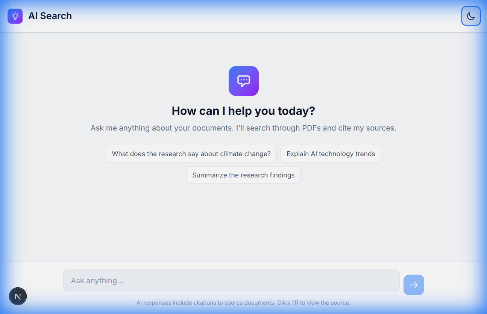

### Dark Mode
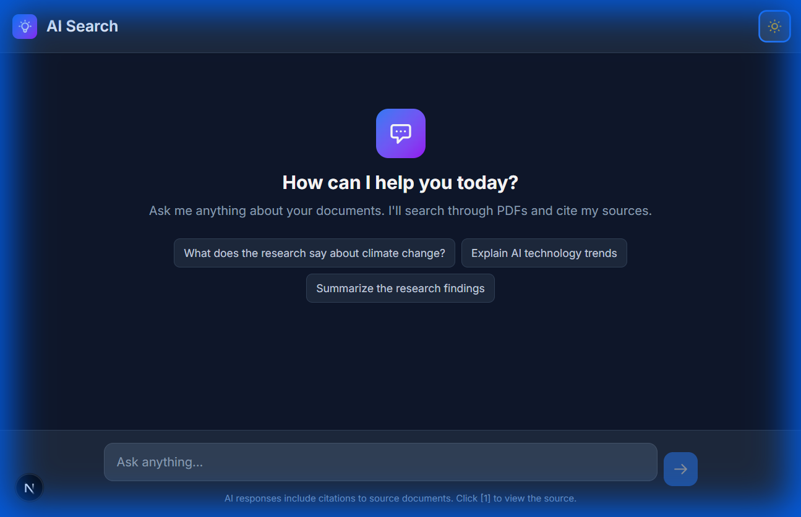

### Split View with PDF
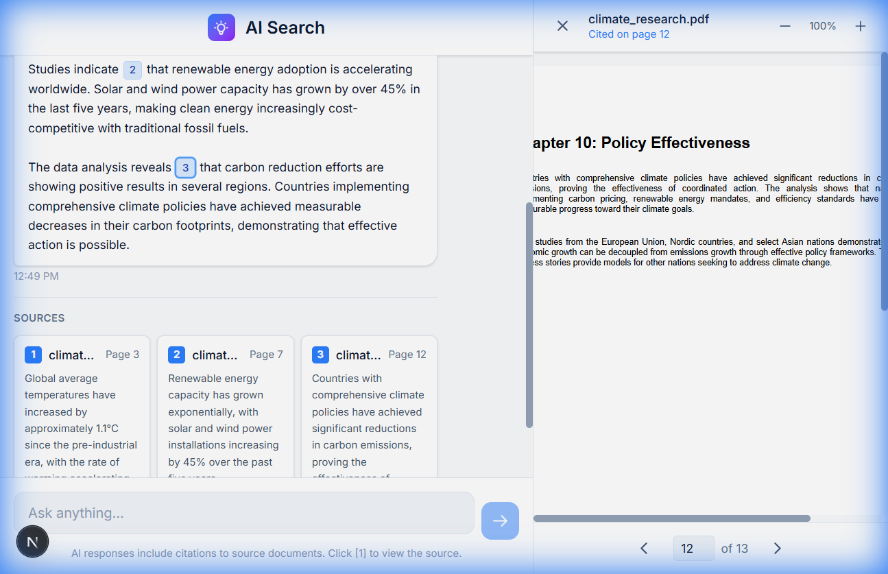

---

## 🐳 Docker Deployment

### Using Docker Compose

```bash
# Build and start all services
docker-compose up --build

# Run in background
docker-compose up -d

# Stop services
docker-compose down
```

### Individual Containers

```bash
# Build backend
docker build -t ai-search-backend ./backend

# Build frontend
docker build -t ai-search-frontend ./frontend

# Run containers
docker run -p 8000:8000 ai-search-backend
docker run -p 3000:3000 ai-search-frontend
```

---

## 📦 Libraries & Dependencies

### Frontend (package.json)

```json
{
  "dependencies": {
    "next": "16.1.1",
    "react": "19.2.3",
    "react-dom": "19.2.3",
    "react-pdf": "^10.2.0",
    "framer-motion": "^12.23.26",
    "zustand": "^5.0.9",
    "clsx": "^2.1.1",
    "tailwind-merge": "^3.4.0"
  },
  "devDependencies": {
    "typescript": "^5",
    "tailwindcss": "^4",
    "@types/react": "^19"
  }
}
```

### Backend (requirements.txt)

```
fastapi==0.109.0
uvicorn[standard]==0.27.0
python-multipart==0.0.6
pypdf2==3.0.1
pdfplumber==0.10.3
pydantic==2.5.3
pydantic-settings==2.1.0
sse-starlette==1.8.2
aiofiles==23.2.1
python-dotenv==1.0.0
reportlab==4.0.8
```

---

## 📄 License

MIT License - see [LICENSE](LICENSE) for details.

---

## 👤 Author

**PAMIDI ROHIT**
- GitHub: [@PAMIDIROHIT](https://github.com/PAMIDIROHIT)

---

## 🙏 Acknowledgments

- Inspired by [Perplexity AI](https://www.perplexity.ai/)
- Built for Full Stack AI Developer Take-Home Assignment

---

*Built with ❤️ using Next.js, FastAPI, and modern web technologies*
